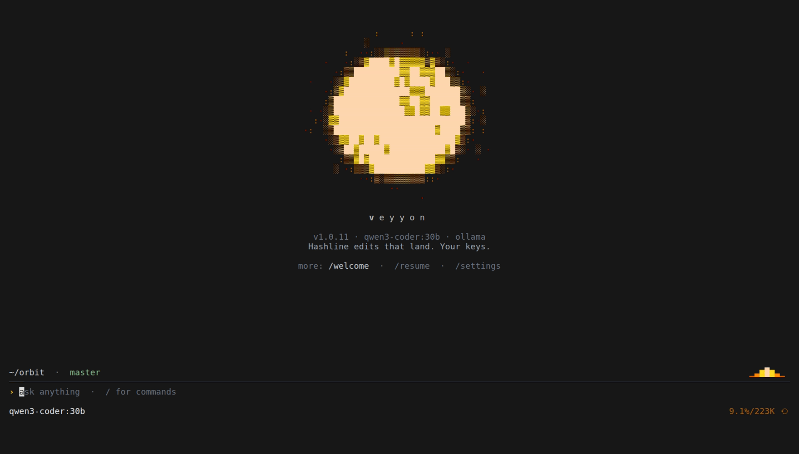
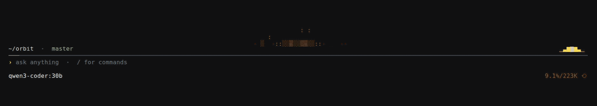
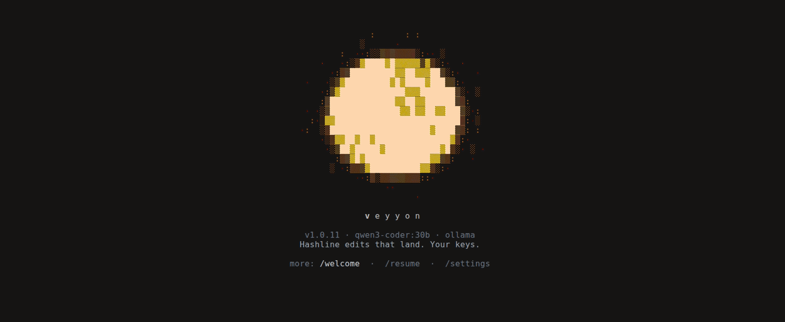
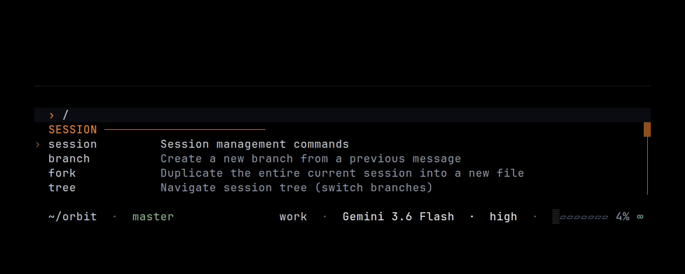

<p align="center">
  
</p>

<p align="center">
  <strong style="font-size: 2.5em; letter-spacing: 0.08em;">Veyyon</strong>
</p>

<p align="center">
  <a href="https://github.com/santhreal/veyyon/releases/latest"></a>
  <a href="https://github.com/santhreal/veyyon/blob/main/packages/coding-agent/CHANGELOG.md"></a>
  <a href="https://github.com/santhreal/veyyon/actions"></a>
  <a href="https://github.com/santhreal/veyyon/blob/main/LICENSE"></a>
  <a href="https://www.typescriptlang.org"></a>
  <a href="https://www.rust-lang.org"></a>
  <a href="https://bun.sh"></a>
</p>

<p align="center">
  <em>A coding agent with the whole workbench wired in.</em>
</p>

<p align="center">
  
</p>

Veyyon runs in your terminal and treats the machinery around your code, the language server, the debugger, the shell, the browser, as tools it can call. The model weights are the same ones you get anywhere. The harness is what changes how reliably they land a change.

Multi-provider catalog · 31 built-in tools (more optional and gated) · LSP and DAP · Rust natives on every hot path · and a per-project shorthand the model writes in.

## Install it in one line

**Linux / macOS**

```sh
curl -fsSL https://get.veyyon.dev | sh
```

**Windows**

```powershell
irm https://veyyon.dev/install.ps1 | iex
```

This installs a single self-contained binary and links a short `vey` command. The first interactive `vey` opens first-run setup (providers, glyphs, theme); re-run it any time with `veyyon setup`. To pin a version or build from a checkout: `curl -fsSL https://get.veyyon.dev | sh -s -- --ref v1.0.12` or `--source`.

**From source (contributing)**

```sh
git clone https://github.com/santhreal/veyyon.git && cd veyyon
bun setup
bun dev
```

`bun setup` installs workspace dependencies and builds `@veyyon/natives`. Re-run `bun run build:native` after changing Rust crates.

Config and state live under `~/.veyyon` by default.

macOS · Linux · Windows · bun ≥ 1.3.14

### Shell completions

`veyyon` generates completion scripts for **bash**, **zsh**, and **fish** from live command and flag metadata. Subcommands, flags, and enum values complete statically; model names (`--model`, `--smol`, `--slow`, `--plan`) resolve against the bundled model catalog and `--resume` against on-disk sessions.

```sh
# zsh: add to ~/.zshrc (or write the output into a file on your $fpath)
eval "$(veyyon completions zsh)"

# bash: add to ~/.bashrc
eval "$(veyyon completions bash)"

# fish
veyyon completions fish > ~/.config/fish/completions/veyyon.fish
```

## The harness is the product

Give two harnesses the same model weights and you get different outcomes, because the edit format, the tool surface, and the way the prompt is assembled all change how reliably the model lands a change. Veyyon leans on that: hashline edits instead of `str_replace`, summarized `read`, in-process search, a real language server, and per-model prompt assembly. Details are in the handbook [Mechanisms](docs/handbook/src/why/innovations.md) chapter.

## New since the fork

Veyyon is a fork of oh-my-pi (MIT). Most of what follows in this README is the shared base both projects run on. This section is what the fork adds on top.

### Argot: a shorthand the model writes in (experimental)

This is the largest thing the fork adds, and it is experimental: off by default, gated per model, and still being proven on live benches. When it is on, the agent loads the project it is working in with the `argot_load` tool, and Veyyon generates a dictionary for that project mapping short handles to the long strings it repeats: a full path, a canonical command, a fixed identifier. The model writes `§dbconn` where it would have written the whole string, and Veyyon restores every handle to its full text before anything runs or reaches your screen.

The round trip is lossless. The model reads and writes less boilerplate, and nothing downstream, no tool, no file, no transcript, ever sees an unexpanded handle. Encoding is gated per model and by context size, so a large or unfamiliar context writes in full instead of risking a garbled handle; decoding always runs, so a handle can never leak. The dictionary is generated per project, kept in a local content-keyed cache, and never committed. See [Argot](docs/handbook/src/why/argot.md).

The fork also adds snap compaction with lossless dedup and artifact spill, shared credentials and global config across profiles, a per-profile working directory, an absolute-token compaction threshold, and atomic, serialized config writes. Each is covered in [Mechanisms](docs/handbook/src/why/innovations.md).

## What it can do

### 01 · The agent writes code that calls its own tools

Ask it to cross-reference two files and it does not grep twice and guess. Persistent Python and Bun eval kernels stay live across the session and call agent tools (`read`, `grep`, `task`, and the rest) over a loopback bridge, so one cell can read, transform, and act.

<p align="center">
  
</p>

### 02 · Renames go through the language server, not find-and-replace

Ask for a rename and the dependent files move with it. Rename and related operations route through the language server (including `workspace/willRenameFiles` where the server supports it), so references update with the edit instead of drifting.

### 03 · It drives a real debugger

A binary segfaults, and the agent attaches over DAP, steps to the bad frame, and reads the values there. Backends (lldb, dlv, debugpy, and others configured for the project) let it step, inspect frames, and evaluate.

### 04 · Rules that wait for the model to go off-script

Your rules sit dormant until a regex matches mid-stream. Then Veyyon aborts the stream mid-token, injects a system reminder, and retries. These injections can survive compaction, so the correction keeps holding.

### 05 · Fan a job out to workers, get typed results back

Split a task with the `task` tool and each worker runs in its own optional isolated worktree with its own tool surface. Workers return schema-validated results to the parent, not free text you have to reparse.

### 06 · A second model, reading every turn

Pair a reviewer to the advisor role and it reads each main-agent turn on its own context, injecting notes into the session when the main agent starts to drift.

### 07 · Hand someone the link and they are in

`/collab` publishes your live session on a relay as a link or QR. Peers join with `veyyon join` or a browser view. Frames are sealed client-side.

### 08 · Read a PDF off arxiv like it is a local file

`read` accepts URLs, PDFs included, and returns structured markdown you use exactly like a path. `web_search` ranks providers, so the agent picks a source instead of guessing a URL.

### 09 · Native on every path, Windows included

Other agents shell out to `rg`, `grep`, `find`, and `bash`. Veyyon runs search, glob, and find in-process through its Rust natives, and shell through brush with session continuity. One binary for macOS, Linux, and Windows.

### 10 · Code review that ends with a verdict

`/review` reads a branch, a commit, or your uncommitted work and returns ranked findings with confidence scores in-session, so you get a call on whether the change ships, not a wall of nits.

### 11 · Edits anchored to content hashes, not line numbers

The model points an edit at a content-hash anchor from an earlier read instead of retyping the surrounding lines. A stale anchor fails verification before anything is written, so a file that moved under the agent cannot silently corrupt a patch.

<p align="center">
  
</p>

### 12 · One read tool for files, URLs, and internal resources

`read` covers filesystem paths, URLs, and internal schemes under a single interface (including PR-shaped paths where configured), so the agent learns one call shape and reuses it everywhere.

### 13 · Memory the agent keeps between sessions

With a backend such as mnemopi enabled, Veyyon retains and recalls project-scoped facts across sessions, so it does not relearn your codebase every time you open it.

### 14 · Drive it from your editor

`veyyon acp` runs as an Agent Client Protocol server, so Zed and other ACP editors get the same tool loop and approval gates as the terminal.

### 15 · It inherits the config your other tools already wrote

With discovery on by default, Veyyon loads context, skills, rules, and MCP from the on-disk layouts of Claude, Codex, Cursor, Gemini, OpenCode, and related tools, with no conversion step. Turn it off with `discovery.importForeignConfig: false`.

### 16 · Commits split into atomic, ordered pieces

`veyyon commit` reads the working tree through `git_overview`, `git_file_diff`, and `git_hunk`, groups the changes into dependency-ordered atomic commits, and rejects cycles before it writes. Lock files stay out of the analysis.

### 17 · A PR is just another path

FS-shaped tools accept internal schemes like `pr://`, `issue://`, `agent://`, `skill://`, `rule://`, and `conflict://` with the same call shapes as filesystem paths, so `read pr://1428` and `agent://<id>/findings.0.path` just work.

### 18 · Each merge conflict is one addressable URL

A conflict hunk is `conflict://N` (or `conflict://*` for all of them). Write `@theirs`, `@ours`, or `@base` to pick a side without hand-editing the markers.

### 19 · Preview a structural rewrite, then accept it

`ast_edit` stages an ast-grep rewrite and returns a proposed preview with the match count. `resolve` accepts or rejects, and an accepted apply is atomic.

### 20 · Drives a real browser, quietly

`browser` drives headless Chromium (Puppeteer) or a CDP-attached target. Stealth defaults are on, so a page sees a normal user rather than an automation fingerprint.

## Whatever the task needs is already a tool

Tools share the agent registry with `read` and `bash`. Restrict the exposed set with `--tools read,edit,bash,…`. Hidden tools stay indexed for `search_tool_bm25` when `tools.discoveryMode` allows discovery.

**Files and search**

- `read`: files, dirs, archives, SQLite, PDFs, notebooks, URLs, internal schemes
- `write`: create or overwrite a file, archive entry, or SQLite row
- `edit`: hashline patches with content-hash anchors
- `ast_edit` / `ast_grep`: structural rewrite preview and queries
- `grep` / `glob`: content regex and path globs

**Runtime**

- `bash`: shell (optional PTY / background jobs)
- `eval`: persistent Python/JS cells
- `ssh`: remote host command

**Code intelligence**

- `lsp`: diagnostics, navigation, symbols, renames, code actions
- `debug`: DAP session control

**Coordination**

- `task`: subagents (optional workspace isolation)
- `irc`: inter-agent messages in-process
- `todo` / `job` / `ask`: list, background jobs, interactive questions

**External and media**

- `browser` / `web_search` / `github`
- `generate_image` / `inspect_image` / `tts`

**Memory and state**

- `checkpoint` / `rewind`
- `retain` / `recall` / `reflect` (Hindsight bank when that backend is active)

**Misc**

- `resolve`: apply or discard a queued preview action.
- `search_tool_bm25`: BM25 over the hidden tool index; activates top matches mid-session.

Setting-gated and off by default: `github`, `inspect_image`, `tts`, `checkpoint`, `rewind`, `search_tool_bm25`, `retain`, `recall`, `reflect`. Flip them on once, scoped per project.

[Tools reference →](packages/coding-agent/README.md)

## Dozens of providers, one `/model` away

- **Interactive model:** `/model` or `--model`; persisted as `modelRoles.default`.
- **Roles:** `smol`, `slow`, `vision`, `plan`, `designer`, `commit`, `tiny`, `task`, `advisor` (plus custom names). Assign in `modelRoles` or settings → Model → Roles. Launch pins: `--smol`, `--slow`, `--plan`.
- **Overrides:** `subagent.model`, `compaction.model` (else inherit interactive).
- **Cycle:** `cycleOrder` (default `smol`, `slow`); keybinding `app.model.cycleForward` (often Ctrl+P).

See [Models, roles, and profiles](docs/handbook/src/using/roles-and-profiles.md).

The auth tags below read as follows: `oauth` signs in with your provider account, `plan` routes through a coding-plan subscription, `local` runs against a local server with the key optional.

### Hosted APIs

Direct APIs and gateways. Mix providers per role.

Anthropic `oauth` · OpenAI · OpenAI Codex `oauth` · Google Gemini · Google Antigravity `oauth` · xAI · Mistral · Groq · Cerebras · Fireworks · Together · Hugging Face · NVIDIA · OpenRouter · Synthetic · Vercel AI Gateway · Cloudflare AI Gateway · Wafer Serverless · Perplexity `oauth`

### Coding plans

Subscription-routed. `/login` attaches the session.

Cursor `oauth` · GitHub Copilot `oauth` · GitLab Duo · Kimi Code `plan` · Moonshot · MiniMax Coding Plan `plan` · MiniMax Coding Plan CN `plan` · Alibaba Coding Plan `plan` · Qwen Portal · Z.AI / GLM Coding Plan `plan` · Xiaomi MiMo · Qianfan · NanoGPT · Novita · Venice · Kilo · ZenMux · OpenCode Go · OpenCode Zen

### Run it yourself

OpenAI-compatible `/v1/models`. Local instances skip the key.

Ollama `local` · Ollama Cloud · LM Studio `local` · llama.cpp `local` · vLLM `local` · LiteLLM

### Routing settings

- **Custom providers**: OpenAI-compatible and other API kinds in `~/.veyyon/profiles/default/agent/models.yml` (`openai-completions`, `openai-responses`, `openai-codex-responses`, `azure-openai-responses`, `anthropic-messages`, `google-generative-ai`, `google-vertex`, …).
- **Fallback chains**: `retry.fallbackChains` (per role or model). On a 429 or quota failure the next entry continues the turn; the primary returns after cooldown.
- **Path-scoped models**: `enabledModels` / `disabledProviders` with a `path:` prefix for repo-local sets.
- **Round-robin credentials**: multiple API keys per provider with session affinity and per-credential backoff.

Provider and routing settings live in `~/.veyyon/profiles/default/agent/models.yml` (see `packages/coding-agent` docs).

## One search tool, many backends behind it

`web_search` is a built-in tool. Mode `auto` walks the configured provider chain; pin a single provider id when you want one. Site-aware extraction turns selected hosts into structured markdown.

### Search providers

Providers (pin one, or `auto`):

| provider     | auth                   |
| ------------ | ---------------------- |
| `auto`       | chain                  |
| `perplexity` | `PERPLEXITY_API_KEY`   |
| `gemini`     | oauth                  |
| `anthropic`  | oauth                  |
| `codex`      | oauth                  |
| `xai`        | `XAI_API_KEY`          |
| `zai`        | `ZAI_API_KEY`          |
| `exa`        | `EXA_API_KEY` (or mcp) |
| `tinyfish`   | `TINYFISH_API_KEY`     |
| `jina`       | `JINA_API_KEY`         |
| `kagi`       | `KAGI_API_KEY`         |
| `tavily`     | `TAVILY_API_KEY`       |
| `firecrawl`  | `FIRECRAWL_API_KEY`    |
| `brave`      | `BRAVE_API_KEY`        |
| `kimi`       | `MOONSHOT_API_KEY`     |
| `parallel`   | `PARALLEL_API_KEY`     |
| `synthetic`  | `SYNTHETIC_API_KEY`    |
| `searxng`    | self-hosted            |
| `duckduckgo` | no key                 |
| `bing`       | no key                 |
| `yahoo`      | no key                 |
| `startpage`  | no key                 |
| `google`     | no key (browser)       |
| `ecosia`     | no key (browser)       |
| `mojeek`     | no key (browser)       |
| `public`     | no key (all of the above, consolidated) |

### Specialized handlers

Host-specific extraction for:

- **Code hosts**: github, gitlab
- **Package registries**: npm, PyPI, crates.io, Hex, Hackage, NuGet, Maven, RubyGems, Packagist, pub.dev, Go packages
- **Research**: arxiv, semantic scholar
- **Forums**: stack overflow, reddit, hn
- **Docs**: mdn, readthedocs, docs.rs

### Security databases

- **NVD**: national vulnerability database
- **OSV**: open source vuln feed
- **CISA KEV**: known exploited vulns

[`web_search` source](packages/coding-agent/src/web/search/index.ts)

## Rust on the hot paths (`@veyyon/natives`)

Four crates, one platform-tagged N-API addon. Search, shell, AST, highlight, PTY, image decode, and BPE counting run in-process on the libuv pool.

- Crates: `veyyon-natives`, `veyyon-shell`, `veyyon-ast`, `veyyon-iso`
- Platforms: `linux-x64`, `linux-arm64`, `darwin-x64`, `darwin-arm64`, `win32-x64`

The table below is a per-module breakdown that intentionally omits glue and tests.

| Module     | What it does                                                                         | Powered by                                |  ~LoC |
| ---------- | ------------------------------------------------------------------------------------ | ----------------------------------------- | ----: |
| shell      | Embedded bash · persistent sessions · timeout/abort · custom builtins                | brush-shell (vendored)                    | 3,700 |
| grep       | Regex search · parallel/sequential · glob & type filters · fuzzy find                | grep-regex · grep-searcher                | 1,900 |
| keys       | Kitty keyboard protocol with xterm fallback · PHF perfect-hash lookup                | phf                                       | 1,490 |
| text       | ANSI-aware width · truncation · column slicing · SGR-preserving wrap                 | unicode-width · segmentation              | 1,450 |
| summary    | Tree-sitter structural source summaries with elision controls                        | tree-sitter · ast-grep-core               | 1,040 |
| ast        | ast-grep pattern matching and structural rewrites                                    | ast-grep-core                             | 1,000 |
| fs_cache   | Mtime-keyed file cache shared by read · grep · lsp                                   | in-tree                                   |   840 |
| highlight  | Syntax highlighting · 11 semantic categories · 30+ aliases                           | syntect                                   |   470 |
| pty        | Native PTY allocation for sudo · ssh interactive prompts                             | portable-pty                              |   455 |
| glob       | Discovery with glob · type filters · mtime sort · gitignore respect                  | ignore · globset                          |   410 |
| workspace  | Workspace walker with gitignore + AGENTS.md discovery in one pass                    | ignore                                    |   385 |
| appearance | Mode 2031 + native macOS dark/light via CoreFoundation FFI                           | core-foundation                           |   270 |
| power      | macOS power-assertion API for idle/system/display-sleep prevention                   | IOKit FFI                                 |   270 |
| task       | Blocking work on libuv thread pool · cancellation · timeout · profiling              | tokio · napi                              |   260 |
| fd         | Filesystem walker for find-tool replacement                                          | ignore                                    |   250 |
| iso        | Workspace isolation shim · apfs · btrfs · zfs · reflink · overlayfs · projfs · rcopy | veyyon-iso (PAL)                              |   245 |
| prof       | Circular buffer profiler with folded-stack and SVG flamegraph output                 | inferno                                   |   240 |
| ps         | Cross-platform process-tree kill and descendant listing                              | libc · libproc · CreateToolhelp32Snapshot |   195 |
| clipboard  | Text copy and image read from system clipboard · no xclip/pbcopy                     | arboard                                   |    80 |
| tokens     | O200k / Cl100k BPE token counting · both tables embedded                             | tiktoken-rs                               |    65 |
| sixel      | Terminal image rendering · decode PNG · JPEG · WebP · GIF · resize · SIXEL encode    | icy_sixel · image                         |    55 |
| html       | HTML to Markdown with optional content cleaning                                      | html-to-markdown-rs                       |    50 |

## Four ways to run the same engine

- **Interactive:** `veyyon` (TUI)
- **One-shot:** `veyyon -p` / `--print`
- **SDK:** embed in Node via `@veyyon/coding-agent`
- **RPC / ACP:** `veyyon --mode rpc` and `veyyon acp` over stdio

### Interactive TUI

The default surface. Tool calls render as cards; the `ask` tool shows a structured option picker. The same permission and ask surfaces route over ACP when the client advertises them.

<p align="center">
  
</p>

### SDK: embed in Node

`@veyyon/coding-agent`

Node and TypeScript hosts pull the engine in directly. The package exposes `ModelRegistry`, `SessionManager`, `createAgentSession`, and `discoverAuthStorage`; the session emits typed events you subscribe to.

```ts
import {
  ModelRegistry,
  SessionManager,
  createAgentSession,
  discoverAuthStorage,
} from "@veyyon/coding-agent";

const auth = await discoverAuthStorage();
const models = new ModelRegistry(auth);
await models.refresh();

const { session } = await createAgentSession({
  sessionManager: SessionManager.inMemory(),
  authStorage: auth,
  modelRegistry: models,
});
await session.prompt("list .ts files");
```

### RPC: drive over stdio

`veyyon --mode rpc`

For non-Node embedders, or when you want process isolation. NDJSON commands in, response and event frames out. `--mode rpc-ui` adds tool cards, selectors, and dialogs as `extension_ui_request` frames the host must answer.

```
$ veyyon --mode rpc --no-session
> {"id":"r1","type":"prompt","message":"list .ts files"}
< {"id":"r1","type":"response", ...}
> {"id":"r2","type":"set_model","provider":"anthropic","modelId":"sonnet-4.5"}
> {"id":"r3","type":"abort"}
```

### ACP: speak to editors

`veyyon acp`

The [Agent Client Protocol](https://github.com/zed-industries/agent-client-protocol) over JSON-RPC. When the editor advertises capabilities, tool I/O routes through it and writes are gated by `session/request_permission`.

| Veyyon tool                   | ACP route                           |
| ----------------------------- | ----------------------------------- |
| `bash`                        | `terminal/create + terminal/output` |
| `read`                        | `fs/read_text_file`                 |
| `write`                       | `fs/write_text_file`                |
| `edit, bash`                  | `session/request_permission`        |

SDK: `@veyyon/coding-agent` (see `packages/coding-agent`).

## Built to extend, not outgrow

Source and releases: [github.com/santhreal/veyyon](https://github.com/santhreal/veyyon).

- **Extensions**: TypeScript modules using the same tool, slash-command, hotkey, and TUI registration APIs as the built-ins.
- **Discovery**: with foreign import enabled, loads rules, skills, and MCP from common on-disk layouts (Claude, Cursor, Codex, Gemini, Windsurf, Cline, Copilot, VS Code, …).
- **Reload**: `/reload-plugins` after local edits; packages publish via npm or marketplaces.

Operator handbook: `docs/handbook/`.

---

## Development

### Getting started from source

Fresh clones need both workspace dependencies and the local Rust/N-API addon before the source CLI can start.

```sh
bun setup
bun dev
```

`bun setup` installs Bun workspaces and builds `@veyyon/natives`. Re-run `bun run build:native` after changing Rust crates or `packages/natives`.

For a non-interactive smoke check:

```sh
bun dev -- --version
```

### Debug Command

`/debug` opens tools for debugging, reporting, and profiling.

For architecture and contribution guidelines, see [packages/coding-agent/DEVELOPMENT.md](packages/coding-agent/DEVELOPMENT.md).

---

## Monorepo Packages

| Package                                                   | Description                                                                |
| --------------------------------------------------------- | -------------------------------------------------------------------------- |
| **[@veyyon/collab-web](packages/collab-web)**           | Browser guest client, mock host, and local relay for collab live sessions  |
| **[@veyyon/ai](packages/ai)**                        | Multi-provider LLM client with streaming and model/provider integration    |
| **[@veyyon/catalog](packages/catalog)**              | Model catalog: bundled model database, provider descriptors, and identity  |
| **[@veyyon/agent-core](packages/agent)**             | Agent runtime with tool calling and state management                       |
| **[@veyyon/coding-agent](packages/coding-agent)**    | Interactive coding agent CLI and SDK                                       |
| **[@veyyon/tui](packages/tui)**                      | Terminal UI library with differential rendering                            |
| **[@veyyon/natives](packages/natives)**              | N-API bindings for grep, shell, image, text, syntax highlighting, and more |
| **[@veyyon/stats](packages/stats)**                 | Local observability dashboard for AI usage statistics                      |
| **[@veyyon/utils](packages/utils)**                  | Shared utilities (logging, streams, dirs/env/process helpers)              |
| **[@veyyon/wire](packages/wire)**                    | Shared collab live-session protocol types and relay constants              |
| **[@veyyon/hashline](packages/hashline)**               | Line-anchored patch language and applier behind the `edit` tool            |
| **[@veyyon/mnemopi](packages/mnemopi)**              | Local SQLite memory engine for Veyyon agents                             |
| **[@veyyon/metaharness](packages/metaharness)**      | Experimentation / meta harness package                                     |
| **[@veyyon/snapcompact](packages/snapcompact)**         | Bitmap-frame context compression package and SQuAD eval suite              |
| **[@veyyon/swarm-extension](packages/swarm-extension)** | Swarm orchestration extension package                                      |

### Rust Crates

| Crate                                              | Description                                                                                         |
| -------------------------------------------------- | --------------------------------------------------------------------------------------------------- |
| **[veyyon-natives](crates/veyyon-natives)**                | Core Rust native addon (N-API `cdylib`) used by `@veyyon/natives`; aggregates the crates below |
| **[veyyon-shell](crates/veyyon-shell)**                    | Embedded shell / PTY / process management split out of `veyyon-natives` (wraps `brush-*`)               |
| **[veyyon-ast](crates/veyyon-ast)**                        | tree-sitter-based code summarizer and AST utilities (50+ language grammars)                         |
| **[veyyon-iso](crates/veyyon-iso)**                        | Task isolation backend resolver: APFS clones, btrfs/zfs reflinks, overlayfs, projfs, rcopy          |
| **[brush-core](crates/vendor/brush-core)**         | Vendored fork of [brush-shell](https://github.com/reubeno/brush) for embedded bash execution        |
| **[brush-builtins](crates/vendor/brush-builtins)** | Vendored bash builtins (cd, echo, test, printf, read, export, etc.)                                 |

## Contributing

See **[CONTRIBUTING.md](CONTRIBUTING.md)** for contribution guidelines.

---

## License

MIT. See [LICENSE](LICENSE) for the full text and copyright notices.

Veyyon is a fork of oh-my-pi (MIT) and Pi, created by Mario Zechner and Can Bölük. Their copyright notices are retained in [LICENSE](LICENSE).

- [GitHub](https://github.com/santhreal/veyyon)
- [Changelog](https://github.com/santhreal/veyyon/blob/main/packages/coding-agent/CHANGELOG.md)
- [Releases](https://github.com/santhreal/veyyon/releases) (the `curl` installer pulls these signed binaries)
- [MIT](https://github.com/santhreal/veyyon/blob/main/LICENSE)
