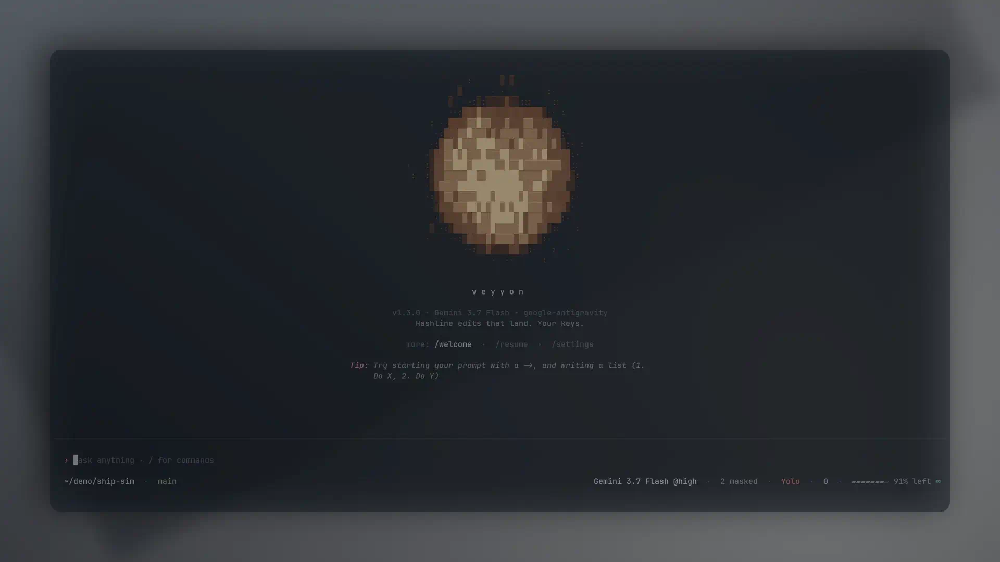
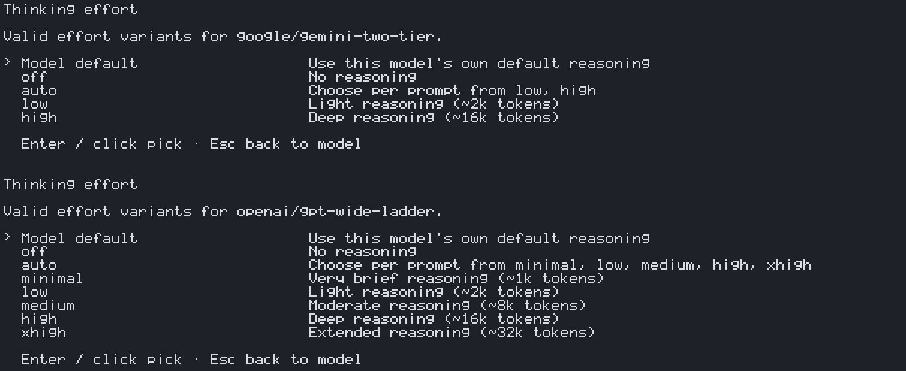
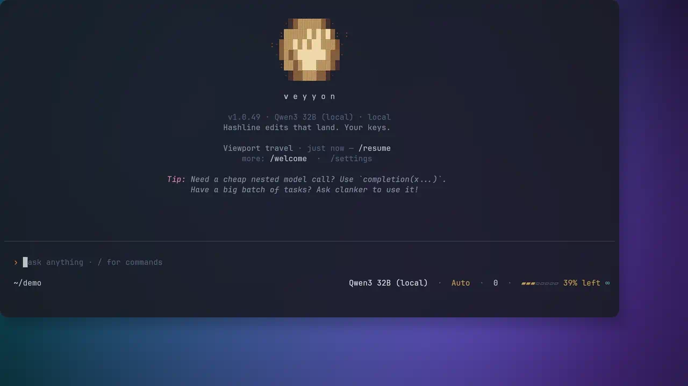
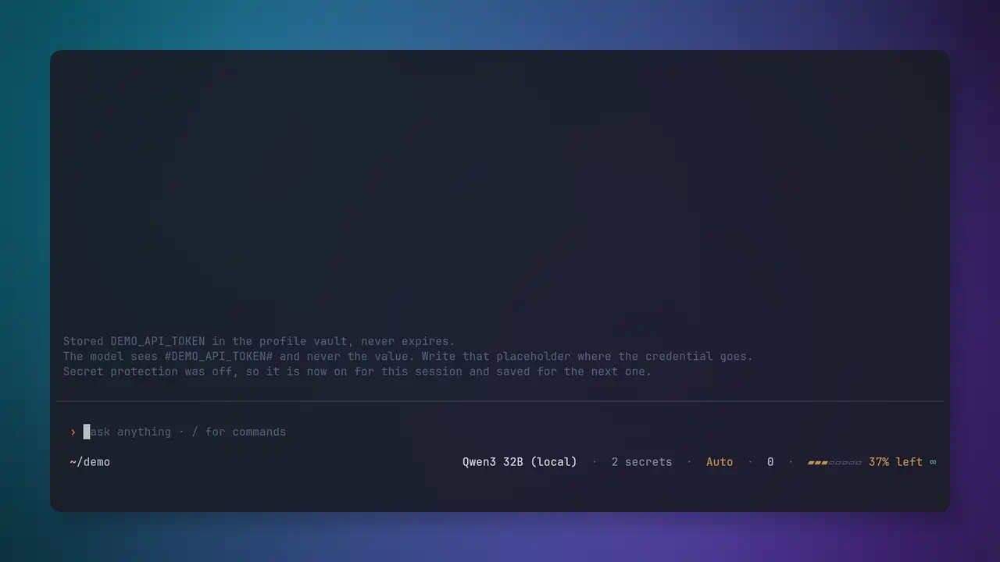
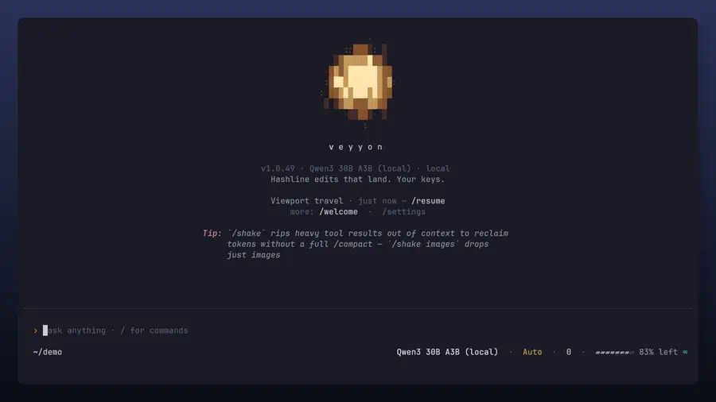
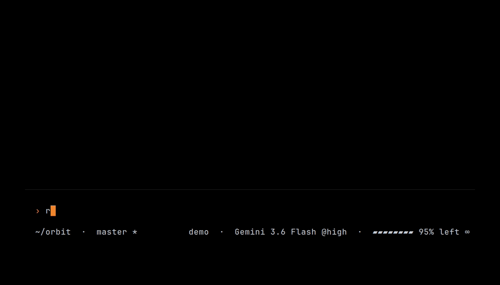
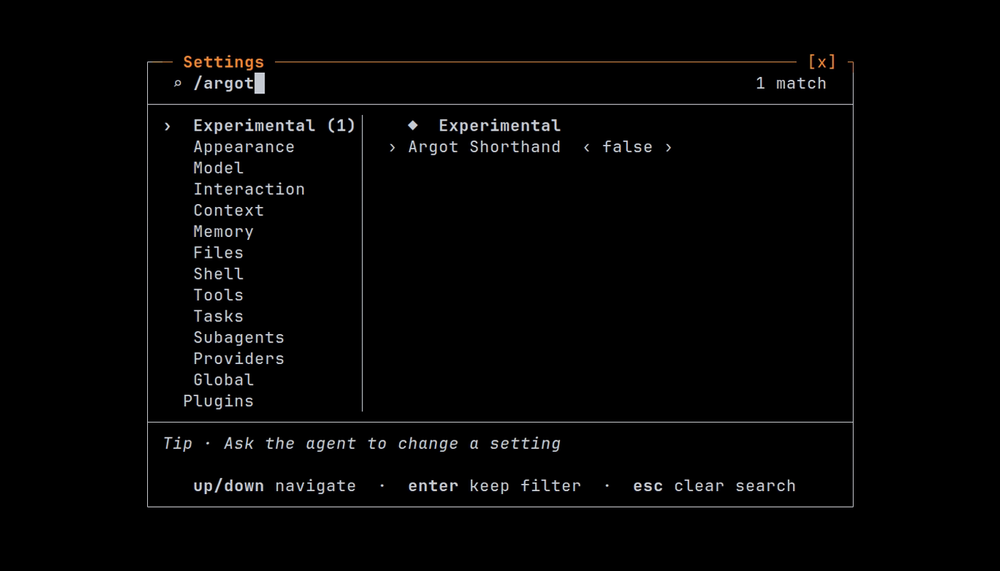
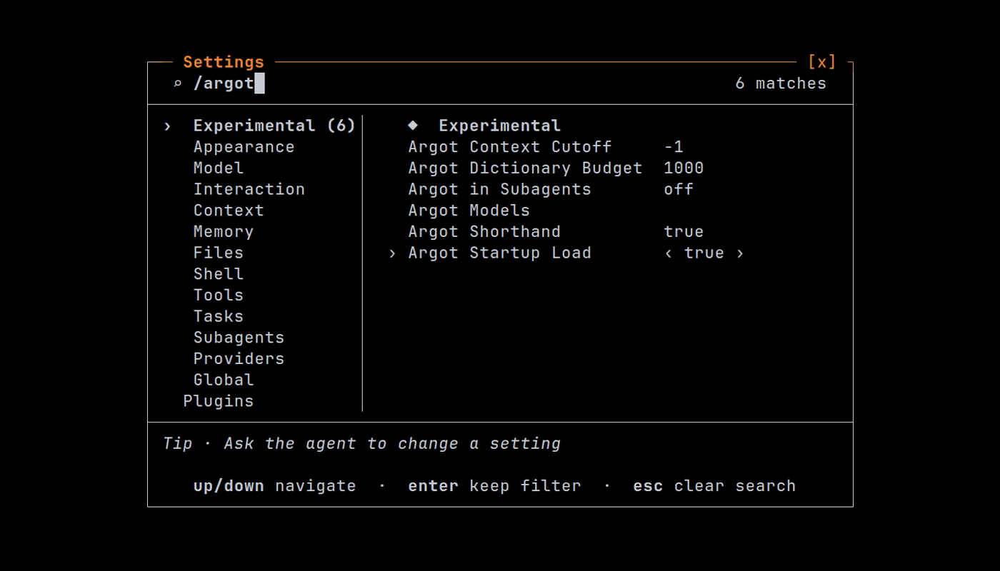

<p align="center">
  
</p>

<h1 align="center">Veyyon</h1>

<p align="center">
  A terminal coding agent whose harness is built for inspectable context, controlled mutation, and long-running work.
</p>

<p align="center">
  <a href="https://github.com/santhreal/veyyon/releases/latest"></a>
  <a href="https://github.com/santhreal/veyyon/actions"></a>
  <a href="LICENSE"></a>
</p>

<p align="center">
  
</p>

Veyyon uses the same model weights available in other clients. The difference is the workbench around them: a prompt you can inspect, model-native effort controls, explicit state ownership, protected secret spending, typed workers, language-server refactors, durable sessions, and tools that fail before stale state becomes a bad write.

Veyyon is a source fork of [oh-my-pi](https://github.com/can1357/oh-my-pi). It is not a clean-room rewrite. [UPSTREAM.md](UPSTREAM.md) records the inherited foundation and the contracts Veyyon changed.

## Install

**Linux and macOS**

```sh
curl -fsSL https://get.veyyon.dev | sh
```

**Windows**

```powershell
irm https://veyyon.dev/install.ps1 | iex
```

The release installer stages one self-contained binary, then checks its SHA-256 sidecar, exact release version, and native search support before it replaces an active install or changes your shell. Prebuilt releases are Linux x64 and arm64 (glibc), macOS x64 and arm64, and Windows x64 only. Windows arm64 runs the x64 build under emulation.

Self-updates use the same preflight. They preserve the previous binary and atomically switch the live path, so a hard kill leaves either the old or new binary available, never a missing command. If an installed completion file cannot be refreshed, the automatic-update notice in the TUI tells you to re-run the installer. Veyyon ships two ways: the release binary the installer downloads, or a checkout you clone and build yourself. There is no npm, Homebrew, or crates.io distribution for the application.

Install and uninstall operations use sidecar ownership receipts. They refuse to overwrite or remove an unrelated executable or completion file that already occupies a Veyyon target path. Updating an install that runs out of a git checkout also verifies the checkout remote and restores the previous clean revision if post-merge provisioning or runtime verification fails.

The installer downloads a verified release binary. It never clones this repository and never builds it. To run an unreleased ref, or to work on Veyyon, clone it yourself into a directory you choose:

```sh
git clone https://github.com/santhreal/veyyon.git
cd veyyon
git checkout v1.0.46   # optional: pin a ref
bun run setup
bun dev
```

That checkout is yours. You picked the directory and you decide when it moves or goes away.

To install a binary you built in that checkout, pass `--local` to the installer.

See [Install Veyyon](docs/handbook/src/using/install.md) for pinned releases, developer checkouts, updates, rollback, and uninstall commands.

## What Veyyon changes

### 1. The prompt is an inspectable program

You can ask Veyyon what the model receives before you spend a token:

```sh
veyyon prompt --sections --cwd ./my-project
veyyon prompt --statements --cwd ./my-project
veyyon prompt --statement tool-selection --cwd ./my-project
```

The outer prompt is a zero-prose scaffold. Registered statements own the actual instructions and their activation conditions. Project context comes from layered `AGENTS.md` files and validated `PROMPT_SECTIONS/` overrides. `/move` reloads cwd-derived context transactionally, so a failed discovery does not leave half of one project mixed with half of another.

<p align="center">
  
</p>

[Prompt customization](docs/system-prompt-customization.md) · [Context files](docs/context-files.md)

### 2. Effort belongs to the model, and compaction is visible

A session effort override wins first. An explicit selector suffix wins next, followed by the saved `defaultEffort[model]` row, the saved `defaultEffort["*"]` row, and finally the model default. `Default` removes the session override. The picker shows only effort variants the selected model supports, so Veyyon does not offer a choice that it will silently clamp into something else.

Compaction uses editable model chains and explicit fallback policy. Before a model summarizes history, a lossless pass removes contained duplicates. Manual and automatic compaction report what happened instead of silently switching models or discarding context.

<p align="center">
  
</p>

<p align="center">
  
</p>

[Models and effort](docs/settings.md#models) · [Compaction and memory](docs/handbook/src/context/compaction-memory.md)

### 3. The model spends placeholders, not credentials

`/secret` stores a credential Veyyon can spend without the model ever seeing it. The model is given a named placeholder; expansion happens at the final outbound tool boundary. The real value stays local, is encrypted at rest, is redacted from later outbound seams, and appears in an operator-visible use log by name rather than value. Scope, expiry, and removal are enforced when the credential is used.

<p align="center">
  
</p>

[Secret protection](docs/secrets.md) · [Secret workflow](docs/handbook/src/features/secrets.md)

### 4. Workers are an operator surface, not hidden subprocesses

The `task` tool starts typed workers concurrently. Workers can coordinate through `irc`, return schema-validated results, persist their transcripts, and expose those results through `agent://` and `history://` URLs. `/agents` opens the Agent Control Center, where you can inspect each worker's live state, model, effort, and lifecycle controls.

<p align="center">
  
</p>

[Subagents](docs/handbook/src/features/subagents.md) · [IRC](docs/tools/irc.md) · [Internal URL routing](docs/tools/read.md#internal-urls)

### 5. Code intelligence writes through the language server

A rename is a symbol operation, not a text replacement. Veyyon asks the active language server for the workspace edit, applies it, and keeps file renames and references together. The edit tool separately uses content-hash anchors, so a file changed since the model read it fails closed before a patch lands.

<p align="center">
  
</p>

[Language servers](docs/tools/lsp.md) · [Editing and repair](docs/handbook/src/using/editing.md)

### 6. Argot shortens repeated project vocabulary without leaking handles

Argot is experimental and off by default. A project dictionary maps repeated paths and phrases to short handles in the model's history. Handles expand before a tool, transcript, child result, parent result, or live display receives them. Disabling teaching does not disable decoding, so an old handle cannot leak after the feature is turned off.

The dependent controls are hidden while Argot is disabled:

<table>
  <tr>
    <td align="center"><br><strong>Off</strong></td>
    <td align="center"><br><strong>On</strong></td>
  </tr>
</table>

Its token economics remain unproven across workloads. The codec boundary is shipped; the performance claim is not assumed.

[Argot design and limits](docs/handbook/src/why/argot.md)

## Demo gallery

Every `*-hd.webp` row below is one real session, captured at 1920x1080 in a
composited terminal and published at 1280x720, driving a dense Qwen3 32B served
locally. The two GIF rows are older VHS tapes against `google-antigravity/gemini-3.6-flash`
at `high` effort in the isolated `demo` profile; `scripts/demos/record.sh` verifies
the exact model before recording and refuses a fallback.

```sh
PROOF_LLM_BASE_URL=http://<host>:11434/v1 bash scripts/demos/record-hd-demo.sh
bash scripts/demos/setup-profile.sh --refresh && bash scripts/demos/record.sh lsp-refactor
```

| Workflow | What the recording proves | Artifact | Regenerate |
| --- | --- | --- | --- |
| End-to-end session | A read, an edit, a command that verifies it, a phased plan, and the settings card, in one unbroken take | [HD session](assets/demo-hd.webp) | `PROOF_LLM_BASE_URL=http://<host>:11434/v1 bash scripts/demos/record-hd-demo.sh` |
| Prompt architecture | Assembled section byte costs with their shares, and the conditional statement registry with the condition each unused statement waits on | [prompt architecture](assets/demo-prompt-hd.webp) | `PROOF_LLM_BASE_URL=http://<host>:11434/v1 bash scripts/demos/record-hd-demo.sh prompt-architecture` |
| Language-server refactor | Cross-file symbol rename and four passing fixture tests | [LSP recording](assets/demo-lsp-refactor.gif) | `bash scripts/demos/record.sh lsp-refactor` |
| File write | A parser with a validated failure mode written into an existing file, then the project's own suite run against it | [write recording](assets/demo-edit-hd.webp) | `PROOF_LLM_BASE_URL=http://<host>:11434/v1 bash scripts/demos/record-hd-demo.sh write-and-test` |
| Plan mode | Read-only inspection under the Plan chip and the Plan Review card it produces | [plan mode](assets/demo-plan-hd.webp) | `PROOF_LLM_BASE_URL=http://<host>:11434/v1 bash scripts/demos/record-hd-demo.sh plan-mode` |
| Context maintenance | A dozen turns filling a 33k window to 71%, then `/compact` cutting the message share from 12.8% to 5.2%, with the report and the footer gauge both moving | [compaction](assets/demo-compaction-hd.webp) | `PROOF_LLM_BASE_URL=http://<host>:11434/v1 bash scripts/demos/record-hd-demo.sh context-compaction` |
| Multi-agent work | Two workers spawned in one turn, the Agent Control Center live, and the same rows idle when they return | [agents](assets/demo-agents-hd.webp) | `PROOF_LLM_BASE_URL=http://<host>:11434/v1 bash scripts/demos/record-hd-demo.sh agent-lanes` |
| Secret boundary | The placeholder listed by name, the approval a secret-bearing call must pass, the byte count of the real value, and the spend recorded by name | [secrets](assets/demo-secret-hd.webp) | `PROOF_LLM_BASE_URL=http://<host>:11434/v1 bash scripts/demos/record-hd-demo.sh secret-boundary` |
| Settings | The settings card under a real pointer: sidebar travel, a category opened by a click, and the Subagents pane it opens on | [settings card](assets/demo-settings-hd.webp) | `PROOF_LLM_BASE_URL=http://<host>:11434/v1 bash scripts/demos/record-hd-demo.sh settings-pointer` |
| Model controls | Native effort variants and ordered chains, rendered from the shipped components on both grounds | [effort](assets/effort-variants-grey.png) / [chains](assets/model-chain-editor-grey.png) | `env -u NO_COLOR FORCE_COLOR=3 bun scripts/demos/render-effort-variants.ts --width 100 \| bun scripts/demos/render-proof.ts --out assets/effort-variants --width 100 --scale 2` |
| Argot gate | Disabled and enabled settings differential | [off](assets/argot-settings-off.png) / [on](assets/argot-settings-on.png) | `bash scripts/demos/record-argot-settings.sh` |
| Command discovery | The slash list arriving, filtering to `/mo`, and the file list off the real working tree | [commands](assets/demo-commands-hd.webp) | `PROOF_LLM_BASE_URL=http://<host>:11434/v1 bash scripts/demos/record-hd-demo.sh popup-grow` |
| Project answer | A read of the rate limiter and one paragraph naming who owns its refill boundary | [answer recording](assets/demo-answer-hd.webp) | `PROOF_LLM_BASE_URL=http://<host>:11434/v1 bash scripts/demos/record-hd-demo.sh project-answer` |
| Installation | Isolated binary install, installed help, and version | [install](assets/install-demo.gif) | `bash scripts/demos/record-install.sh` |

A committed tape must submit the action and finish on its result. A settings proof must show a differential, not one default screenshot. The recording contract lives in [record-demo](.veyyon/skills/record-demo/SKILL.md) and [prove-feature](.veyyon/skills/prove-feature/SKILL.md).

## The complete workbench

The gallery leads with Veyyon-owned contracts. The rest of the product is still available when the task needs it.

| Area | Production surface |
| --- | --- |
| Files and data | Files, directories, archives, SQLite, PDFs, notebooks, URLs, and internal resources through `read`; exact creation through `write`; hash-anchored patches through `edit` |
| Search and structure | Native `grep` and `glob`; tree-sitter summaries; `ast_grep` discovery; previewed and resolved `ast_edit` rewrites |
| Runtime | Persistent shell sessions, supervised processes, persistent Python and Bun kernels, SSH, and DAP debugging |
| Code intelligence | Diagnostics, navigation, references, implementations, code actions, symbol rename, and rename-file through `lsp` |
| Browser and research | Chromium/CDP control, web search provider routing, URL extraction, images, and speech tools when enabled |
| Coordination | Tasks, IRC, background jobs, todos, interactive questions, checkpoints, rewind, and agent URLs |
| Sessions | Resume, branch, fork, export, compaction, goal continuation, plan mode, review, and project-scoped memory |
| Integrations | MCP, extensions, hooks, skills, custom commands, ACP, RPC, SDK embedding, and encrypted collaboration |

Use `/` to search commands and `/settings` to search configuration. The generated references stay closer to the registries than a hand-maintained README list:

- [Slash commands](docs/handbook/src/reference/slash-commands.md)
- [Settings reference](docs/settings-reference.md)
- [Tool guides](docs/tools/)
- [Environment variables](docs/environment-variables.md)
- [File locations](docs/handbook/src/reference/file-locations.md)

## Models, providers, and routing

Use `/model` or `--model` for the interactive model. Assign `smol`, `slow`, `plan`, `designer`, `commit`, `advisor`, and custom roles independently. Compaction and subagents own separate ordered model chains. Retry fallback chains, path-scoped model filters, several credentials per provider, session affinity, and per-credential cooldown are explicit configuration.

Veyyon supports direct APIs, OAuth coding subscriptions, gateways, and local OpenAI-compatible servers. The catalog changes more often than this README. Run `veyyon models` for the active catalog and see [Models, roles, and profiles](docs/handbook/src/using/roles-and-profiles.md) for routing.

## Four ways to run the engine

```sh
veyyon                         # interactive TUI
veyyon -p "inspect this repo"  # one-shot output
veyyon --mode rpc             # NDJSON RPC over stdio
veyyon acp                    # Agent Client Protocol for editors
```

TypeScript hosts can also use the session SDK. All four surfaces share the model registry, session runtime, tool policy, and approval semantics.

[ACP and CLI modes](docs/handbook/src/reference/cli.md) · [Extensions](docs/extensions.md) · [Custom tools](docs/custom-tools.md)

## Provenance

### Inherited foundation

Veyyon retains the Bun and TypeScript agent loop, terminal UI, provider catalog, role routing, hashline edit engine, mnemopi memory, and the original native grep, PTY, and tree-sitter hot-path foundations from oh-my-pi. These remain important product capabilities. They are not presented as Veyyon inventions.

### Veyyon-owned contracts

Veyyon owns the statement-based prompt architecture, transactional context moves, model-native effort and explicit effort precedence, current compaction strategy and chains, provider-bound secret protection, profile/session durability rules, LSP write-through, capability and tool registry, typed worker and IRC operations, Agent Control Center, internal agent URLs, post-fork reusable Rust crate boundaries and their current contracts, and Argot integration boundaries described above.

This boundary describes this repository. It does not claim that current upstream has stood still. Read [UPSTREAM.md](UPSTREAM.md), the [mechanisms chapter](docs/handbook/src/why/innovations.md), and the [intentional divergence ledger](docs/internal/porting-from-pi-mono.md#15-intentional-divergences) for the detailed record.

## Development

```sh
bun setup
bun dev
bun run check
```

`bun setup` installs workspace dependencies and builds the local Rust/N-API addon. See [CONTRIBUTING.md](CONTRIBUTING.md) and [packages/coding-agent/DEVELOPMENT.md](packages/coding-agent/DEVELOPMENT.md) before changing the runtime.

## License

Veyyon is licensed under MIT. See [LICENSE](LICENSE).

Run `veyyon licenses` to print the complete notice bundle embedded in every
release binary. The same bundle is available as
[`THIRD_PARTY_LICENSES.txt`](THIRD_PARTY_LICENSES.txt) in a source checkout.

The project is derived from oh-my-pi. Upstream copyright and license notices are preserved in [UPSTREAM.md](UPSTREAM.md) and the source tree.
