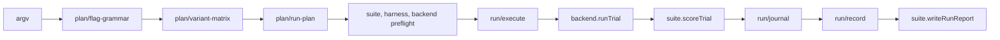

# Architecture

## Members

Everything the evals run is a member, found by scanning a directory. There is no registry to edit:
adding a member is adding a file.

| Kind | Directory | Shape | Run by |
|---|---|---|---|
| suite | `suites/` | default-exports an `EvalSuite` | `evals --suite <id>` |
| harness | `harnesses/` | default-exports a `HarnessAdapter` | `--harness <id>` |
| backend | `backends/` | default-exports an `ExecutionBackend` | the suite's `backend` |
| bench | `benches/` | a program run under `import.meta.main` | `evals bench <id>` |
| measurement | `measurements/` | a program | `evals measure <id>` |
| tool | `tools/` | a program | `evals tool <id>` |

A member is `<dir>/<id>.ts`, or `<dir>/<id>/main.ts` when it needs more than one file. A name that
starts with `_` is skipped, which is how a directory keeps a shared helper. A descriptor's `id`
equals its file or directory name. `engine/members/discovery.ts` holds these rules;
`engine/members/loaded.ts` holds the loaded registries.

## The engine

`engine/` holds everything a member builds on. Each directory is one concern.

| Module | Holds |
|---|---|
| `engine/contracts.ts` | The interfaces between members: `EvalSuite`, `HarnessAdapter`, `ExecutionBackend`, `Variant`, `TrialCell`, `TrialArtifacts`, `TrialScore`. |
| `engine/members/` | Discovery and the registries. |
| `engine/plan/` | The flag grammar, the variant matrix and its axes, the run plan and its identity, overlays. |
| `engine/run/` | Executing a plan: the worker pool, the journal, the run directory layout, the run record. |
| `engine/trial/` | One trial: its deadline, its model, its process, its retry rule, how its outcome is classified. |
| `engine/kit/` | Writing a benchmark as seeded tasks graded by recorded state (see [the kit](kit.md)). |
| `engine/compare/` | Statistics and comparisons: Wilson intervals, sign tests, Holm correction, paired arms. |
| `engine/harness/` | What harnesses share: preflight, the container program, arm attachments, local endpoints. |
| `engine/auth/` | Choosing, seeding and checking the credential store a run uses. |
| `engine/io/` | Bounded commands, bounded fetches, file listing. |
| `engine/wire/` | Shapes the run store and the dashboard exchange. |
| `engine/corpus/` | Reading agent transcripts as a corpus. |
| `engine/package-paths.ts` | Every directory this package reads or writes, and the path-segment rule. |

A module in `engine/` never imports a suite, a harness or a backend. A member reaches the roster
through the `HarnessLookup` a run carries, not by importing the loader.

## A run

1. The flags become a selection; the variant matrix expands it into variants, and the plan crosses
   variants, tasks and repeats into cells.
2. Every axis the plan varies must be applied by the suite's backend and accepted by each variant's
   harness, or the run is refused before any preflight runs.
3. The suite, each harness and the backend run their preflights. A refusal ends the run.
4. Workers take cells in order. For each cell the backend runs the trial and the suite scores it;
   the result is appended to `trials.jsonl`. A trial that throws before it produces a result is
   attempted again up to `--attempts`. A trial the run's cancellation cuts short settled nothing and
   is not appended.
5. When every cell settled, the run record is written and the suite writes its report.

A resumed run reads `trials.jsonl` and runs only the cells it does not hold.
